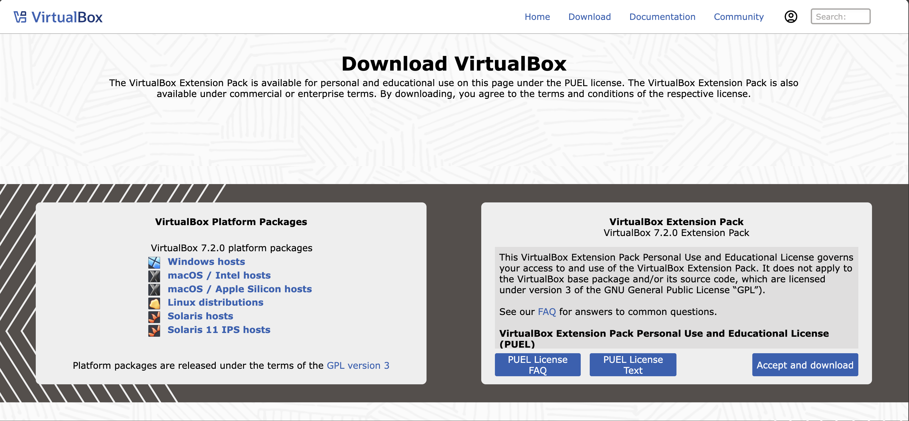
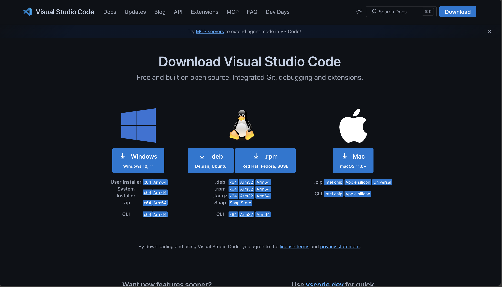
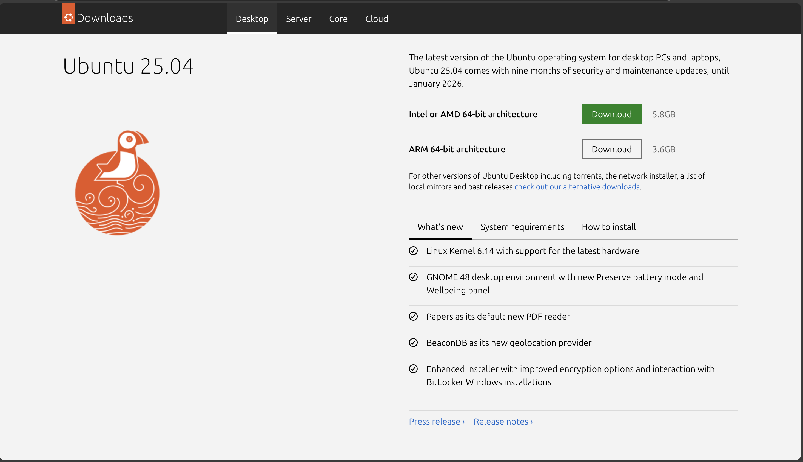

Alright — let’s break it into **clear step-by-step instructions** so you can get Ubuntu, VS Code, and VirtualBox downloaded and set up.

---

## **1️⃣ Download Ubuntu**

Ubuntu is a Linux operating system. If you’re installing it in VirtualBox or UTM, you’ll need the `.iso` file.

**Steps:**

1. Go to the official Ubuntu download page: [https://ubuntu.com/download/desktop](https://ubuntu.com/download/desktop)
2. Choose the latest **LTS (Long Term Support)** version — for stability (e.g., Ubuntu 24.04 LTS).
3. Click **Download** and wait for the `.iso` file to finish downloading (around 3–5 GB).
4. Keep this `.iso` file — you’ll need it in VirtualBox.

---

## **2️⃣ Download Visual Studio Code (VS Code)**

VS Code is the code editor we’ll use to write programs.

**Steps:**

1. Visit: [https://code.visualstudio.com/download](https://code.visualstudio.com/download)
2. Choose the version for your operating system:

   * **macOS** → Download `.zip` or `.dmg`
   * **Windows** → Download `.exe`
   * **Linux** → Download `.deb` or `.rpm`
3. Install it:

   * **macOS** → Open the `.dmg` and drag VS Code to **Applications**.
   * **Windows** → Run the `.exe` installer.
   * **Linux** → Install via Software Center or terminal.
4. Open VS Code to confirm it works.

---

## **3️⃣ Download VirtualBox**

VirtualBox lets you run Ubuntu on your computer without replacing your main OS.

**Steps:**

1. Go to: [https://www.virtualbox.org/wiki/Downloads](https://www.virtualbox.org/wiki/Downloads)
2. Under **Platform packages**, choose your OS:

   * **Windows hosts** → `.exe`
   * **macOS hosts** → `.dmg`
   * **Linux distributions** → follow package manager instructions.
3. Download and install VirtualBox.
4. (Optional) Also download **VirtualBox Extension Pack** from the same page — this adds extra features like USB support.
5. Open VirtualBox after installation.

---

## **4️⃣ Next Steps After Download**

Once all three are installed:

* Open **VirtualBox** → Click **New** → Set name as "Ubuntu" → Select type as **Linux** and version as **Ubuntu (64-bit)** → Allocate RAM (at least 4GB) → Create Virtual Hard Disk (20–50 GB) → Mount the `.iso` file you downloaded → Start.
* Install Ubuntu inside VirtualBox.
* Once Ubuntu is running, you can also install **VS Code inside Ubuntu** if you want to code there.

---

If you want, I can also give you a **full guide with screenshots** showing how to create an Ubuntu virtual machine in VirtualBox after downloading. Would you like me to prepare that?

